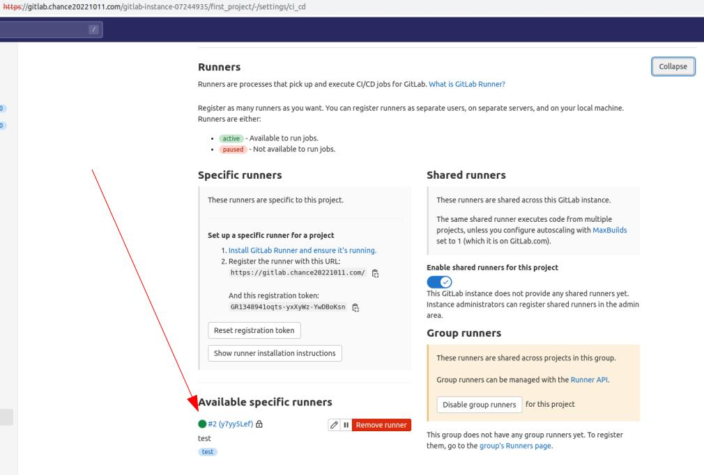

# Project Name: Gitlab CICD Pipeline
This project will setup a Gitlab CICD pipeline, which will build the source code to a docker image and push to container registory in Gitlab and then re-deploy the docker container with the latest image in your local host.

# Project Goal
Understand how to setup/configure Gitlab as CICD pipeline. Familarize with gitlab pipeline.

# Table of Contents
1. [Prerequisites](#prerequisites)
2. [Project Steps](#project_steps)
3. [Troubleshooting](#troubleshooting)
4. [Reference](#reference)

# <a name="prerequisites">Prerequisites</a>
- Ubuntu 20.04 OS
- Docker
- Docker Compose

# <a name="project_steps">Project Steps</a>
1. Run the docker container with docker-compose
```bash
git clone https://github.com/chance2021/devopsdaydayup.git
cd devopsdaydayup/003-GitlabCICD
docker-compose up -d
```

2. Add below entry in your hosts file (i.g. `/etc/hosts`). Open your browser and go to https://<your_gitlab_domain_name> 
```
<GITLAB SERVER IP>  <YOUR DOMAIN NAME in docker-compose.yaml> 
# For example
# 192.168.1.2 gitlab.chance20221011.com
```

3. Login to the Gitlab with username `root` and the password defined in your `docker-compose.yaml`. Click "New project" to create your first project ("Create blank project" -> Type your project name ins "Project Name" -> Select  "Public" -> Inside the new project, go to "Setting" -> "CICD" -> expand "Runners". Make a note of "URL and registration token in "Specific runners" section for below runner installation used).

4. Since the initial Gitlab CA certificate is missing some info and cannot be used by gitlab runner, we may have to regenerate/configure a new one. Run below commands:
```bash
docker exec -it <gitlab_web_containerID> bash
mkdir /etc/gitlab/ssl_backup
mv /etc/gitlab/ssl/* /etc/gitlab/ssl_backup
cd /etc/gitlab/ssl
openssl genrsa -out ca.key 2048
openssl req -new -x509 -days 365 -key ca.key -subj "/C=CN/ST=GD/L=SZ/O=Acme, Inc./CN=Acme Root CA" -out ca.crt

# Note: Make sure to replace below `YOUR_GITLAB_DOMAIN` with your own domain name. For example, chance20221011.com.
export YOUR_GITLAB_DOMAIN=chance20221011.com
openssl req -newkey rsa:2048 -nodes -keyout gitlab.$YOUR_GITLAB_DOMAIN.key -subj "/C=CN/ST=GD/L=SZ/O=Acme, Inc./CN=*.$YOUR_GITLAB_DOMAIN" -out gitlab.$YOUR_GITLAB_DOMAIN.csr
openssl x509 -req -extfile <(printf "subjectAltName=DNS:$YOUR_GITLAB_DOMAIN,DNS:gitlab.$YOUR_GITLAB_DOMAIN") -days 365 -in gitlab.$YOUR_GITLAB_DOMAIN.csr -CA ca.crt -CAkey ca.key -CAcreateserial -out gitlab.$YOUR_GITLAB_DOMAIN.crt

# Certificate for nginx (container registry)
openssl req -newkey rsa:2048 -nodes -keyout registry.gitlab.$YOUR_GITLAB_DOMAIN.key -subj "/C=CN/ST=GD/L=SZ/O=Acme, Inc./CN=*.$YOUR_GITLAB_DOMAIN" -out registry.gitlab.$YOUR_GITLAB_DOMAIN.csr
openssl x509 -req -extfile <(printf "subjectAltName=DNS:$YOUR_GITLAB_DOMAIN,DNS:gitlab.$YOUR_GITLAB_DOMAIN,DNS:registry.gitlab.$YOUR_GITLAB_DOMAIN") -days 365 -in registry.gitlab.$YOUR_GITLAB_DOMAIN.csr -CA ca.crt -CAkey ca.key -CAcreateserial -out registry.gitlab.$YOUR_GITLAB_DOMAIN.crt

# Enable container register
 registry_external_url 'https://registry.gitlab.$YOUR_GITLAB_DOMAIN.com:5005'
 gitlab_rails['registry_enabled'] = true
 gitlab_rails['registry_host'] = "registry.gitlab.$YOUR_GITLAB_DOMAIN.com"
 gitlab_rails['registry_port'] = "5005"
 gitlab_rails['registry_path'] = "/var/opt/gitlab/gitlab-rails/shared/registry"
 gitlab_rails['registry_api_url'] = "http://127.0.0.1:5000"
 gitlab_rails['registry_key_path'] = "/var/opt/gitlab/gitlab-rails/certificate.key"
 registry['enable'] = true
 registry['registry_http_addr'] = "127.0.0.1:5000"
 registry['log_directory'] = "/var/log/gitlab/registry"
 registry['env_directory'] = "/opt/gitlab/etc/registry/env"
 registry['env'] = {
   'SSL_CERT_DIR' => "/opt/gitlab/embedded/ssl/certs/"
 }
 registry['rootcertbundle'] = "/var/opt/gitlab/registry/gitlab-registry.crt"
 nginx['ssl_certificate'] = "/etc/gitlab/ssl/registry.gitlab.$YOUR_GITLAB_DOMAIN.com.crt"
 nginx['ssl_certificate_key'] = "/etc/gitlab/ssl/registry.gitlab.$YOUR_GITLAB_DOMAIN.com.key"
 registry_nginx['enable'] = true
 registry_nginx['listen_port'] = 5005

# Reconfigure the gitlab to apply above change
gitlab-ctl reconfigure
gitlab-ctl restart
cat /etc/gitlab/ssl/gitlab.$YOUR_GITLAB_DOMAIN.crt
exit

# In your host
vi /usr/local/share/ca-certificates/gitlab-server.crt
# Paste above certificate content copied from gitlab server
update-ca-certificates

# In order to make docker login work, you need to add the certificate in docker certs folder
export YOUR_GITLAB_DOMAIN=chance20221011.com
sudo mkdir -p /etc/docker/certs.d/registry.gitlab.$YOUR_GITLAB_DOMAIN:5005
sudo docker cp <YOUR_GITLAB_CONTAINER>:/etc/gitlab/ssl/ca.crt /etc/docker/certs.d/registry.gitlab.$YOUR_GITLAB_DOMAIN:5005


# Login to gitlab-runner
docker exec <gitlab runner container> -it bash
vi /usr/local/share/ca-certificates/gitlab-server.crt
# Paste above certificate content copied from gitlab server
update-ca-certificates
gitlab-runner register 
# Enter the GitLab instance URL (for example, https://<YOUR_GITLAB_DOMAIN>(i.g. https://gitlab.chance20221011.com)

Enter the registration token:
<Paste the token retrieved in Step 3>

Enter a description for the runner:
[bad518d25b44]: test

Enter tags for the runner (comma-separated):
test

Enter optional maintenance note for the runner:
test

Registering runner... succeeded                     runner=GR1348941Pjv5Qzaz
Enter an executor: ssh, docker+machine, docker-ssh, docker, parallels, shell, virtualbox, docker-ssh+machine, kubernetes, custom:
shell
```
If successful, you will see below message:
```
Runner registered successfully. Feel free to start it, but if it's running already the config should be automatically reloaded!

Configuration (with the authentication token) was saved in "/etc/gitlab-runner/config.toml" 
root@bad518d25b44:/usr/local/share/ca-certificates# cat /etc/gitlab-runner/config.toml 
```

Once you finish above step, you should be able to see an available running in the project's CICD Runners section.


5. Git clone the new project repo, which you created in your gitlab server, to your local and create a file called `.gitlab-ci.yml` and add/commit/push with below content in
```
<Need to be updated>
```

6. Go to your gitlab web and go to "Settings" -> "CI/CD" -> expand "Variables". Click "Add variable"

7. 

```
 registry_external_url 'https://registry.gitlab.chance20221011.com'                         
                                                                                    
 gitlab_rails['registry_enabled'] = true                                     
 gitlab_rails['registry_host'] = "registry.gitlab.chance20221011.com"                                            
 gitlab_rails['registry_port'] = "5005"                                                                                                                                                                    
 gitlab_rails['registry_path'] = "/var/opt/gitlab/gitlab-rails/shared/registry" 

 gitlab_rails['registry_api_url'] = "http://127.0.0.1:5000"                                          gitlab_rails['registry_key_path'] = "/var/opt/gitlab/gitlab-rails/certificate.key"
 registry['enable'] = true

```


# Troubelshooting
## Issue 1: Letencrypt DNS issue
**Soluton:**
Chnage hostname to .com and wait for 1 hour

## Issue 2: Cannot register gitlab-runner: connection refused
When run `gitlab-register`, it shows below error:

```
ERROR: Registering runner... failed                 runner=GR1348941oqts-yxX status=couldn't execute POST against https://gitlab.chance20221011.com/api/v4/runners: Post "https://gitlab.chance20221011.com/api/v4/runners": dial tcp 0.0.0.0:443: connect: connection refused
```

**Solution:**
Make sure to follow step 4 to regerate a new certificate with proper info and update it in gitlab-runner host/container

## Issue 3: Cannot login docker registry: x509: certificate signed by unknown authority
Cannot log in to the gitlab container registry. Below error is returned

```
$ docker login registry.gitlab.chance20221011.com:5005
Username: root
Password: 
Error response from daemon: Get "https://registry.gitlab.chance20221011.com:5005/v2/": x509: certificate signed by unknown authority
```
**Cause:**
You are using a self-signed certificate for your gitlab container registry instead of the certificate issued by a trusted CA. The docker daemon doesnot trust the self-signed cert which causes this error

**Solution:**
You must instruct docker to trust the self-signed certificate by copying the self-signed certificate to `/etc/docker/certs.d/<your_registry_host_name>:<your_registry_host_port>/ca.crt` on the machine where running the docker login command. 
```
export YOUR_GITLAB_DOMAIN=chance20221011.com
export YOUR_GITLAB_CONTAINER=<Gitlab Container ID>

sudo mkdir -p /etc/docker/certs.d/registry.gitlab.$YOUR_GITLAB_DOMAIN:5005
sudo docker cp $YOUR_GITLAB_CONTAINER:/etc/gitlab/ssl/ca.crt /etc/docker/certs.d/registry.gitlab.$YOUR_GITLAB_DOMAIN:5005
```
> Refer to:
> https://www.ibm.com/docs/en/cloud-paks/cp-management/2.2.x?topic=tcnm-logging-into-your-docker-registry-fails-x509-certificate-signed-by-unknown-authority-error
> https://7thzero.com/blog/private-docker-registry-x509-certificate-signed-by-unknown-authority

#<a name="reference">Reference</a>
https://docs.gitlab.com/ee/install/docker.html#install-gitlab-using-docker-compose
[Runner Cannot Register with error: x509: certificate relies on legacy Common Name field, use SANs instead](https://gitlab.com/gitlab-org/gitlab-runner/-/issues/28841)

[Enable Container Registry](https://blog.programster.org/dockerized-gitlab-enable-container-registry)

