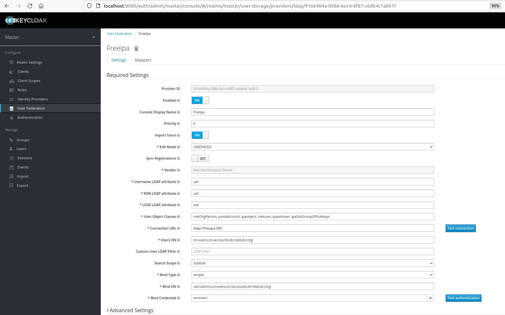
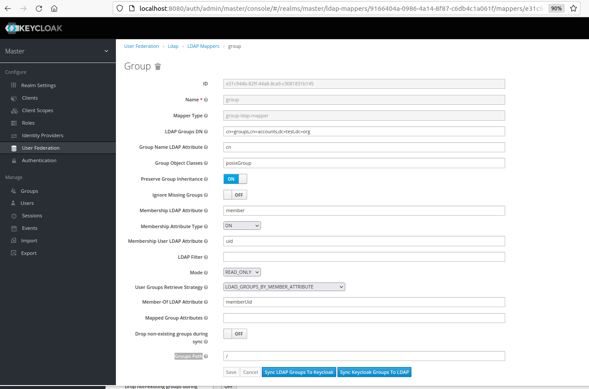

# Project Name: Federate User/Group Info From FreeIPA to Keycloak

## Project Goal
In this lab, you will learn how to establish a federated identity management system by integrating user and group information from a **FreeIPA server** into a **Keycloak instance**. This integration will enable users to authenticate and access resources across multiple systems using a single set of credentials, while also providing administrators with centralized control over user access and permissions. Through this lab, you will gain practical experience in implementing a federated identity solution that can improve security and streamline user management in complex enterprise environments.

## Table of Contents
1. [Prerequisites](#prerequisites)
2. [Project Steps](#project_steps)
3. [Post Project](#post_project)
4. [Troubleshooting](#troubleshooting)
5. [Reference](#reference)

## <a name="prerequisites">Prerequisites</a>
- Ubuntu 20.04 OS (Minimum 2 core CPU/8GB RAM/30GB Disk)
- Docker(see installation guide [here](https://docs.docker.com/get-docker/))
- Docker Compose(see installation guide [here](https://docs.docker.com/compose/install/))
- Minikube (see installation guide [here](https://minikube.sigs.k8s.io/docs/start/))
- Helm (see installation guide [here](https://helm.sh/docs/intro/install/)


## <a name="project_steps">Project Steps</a>

### 1. Deploy Keycloak/Postgres/FreeIPA via Docker-compose
**Clone** the repo and run the docker compose to spin up the containers
```
git clone https://github.com/chance2021/devopsdaydayup.git
cd devopsdaydayup/keycloak-integration/freeipa
docker-compose up -d
```

### 2. Add a DNS Record into **hosts** file
Add `127.0.0.1 ipa.test.org' into `/etc/hosts` file
```
sudo cp /etc/hosts /etc/hosts.bak.test
echo "127.0.0.1 ipa.test.org" | sudo tee -a /etc/hosts
```
Then you should be able to access **FreeIPA** website via [http://ipa.test.org](http://ipa.test.org) in your local browser
> Note: The admin username is `admin` and the password is under `.env` file (should be `admin123` as default)

### 3. [Optional] Migrate Users/Groups from an Existing FreeIPA server
If you have **an existing FreeIPA/OpenLDAP server** and would like to **migrate** the users/groups, you can follow below steps:
- a. Access to the **FreeIPA docker container**
```
docker exec -it freeipa_freeipa_1 bash
```
- b. **Login** with the `admin` user
```
kinit
<Eenter the admin password which is under `.env` file>
```
- c. Run the **migration** commands
```
ipa migrate-ds --bind-dn="uid=admin,cn=users,cn=accounts,dc=existing-freeipa,dc=org" --with-compat --user-container=cn=users,cn=accounts,dc=existing-freeipa,dc=org --group-container=cn=groups,cn=accounts,dc=existing-freeipa,dc=org --group-objectclass=posixgroup --schema=RFC2307 ldap://<existing-freeipa server ip>
```
> Note: Please update above `dc` and `existing-freeipa server ip` fitted in your case

Once it is done, you can see all users/groups have been imported via FreeIPA website ([http://ipa.test.org](http://ipa.test.org))

### 4. Configure Keycloak
**Login** to Keycloak website ([http://localhost:8080](http://localhost:8080)) with the username `test` and password `Test2023!` (Note: you can refer it in `docker-compose.yaml` under `KEYCLOAK_ADMIN_USER` and `KEYCLOAK_ADMIN_PASSWORD`). </n>

Then you can go to **"User Federation"** section in the left navigation lane and click **"Add provider"**, and choose **"ldap"**. You can fill the fields as below:
- Enabled: ON
- Console Display Name: freeipa
- Priority: 0
- Import Users: ON
- **Edit Mode**: UNSYNCED
- Sync Registrations: ON
- **Vendor**: Red Hat Directory Server
- Username LDAP attribute: uid
- RDN LDAP attribute: uid
- UUID LDAP attribute: uid
- **User Object Classes**: inetOrgPerson, posixAccount, ipaobject, inetuser, ipasshuser, ipaSshGroupOfPubKeys
- **Connection URL**: ldap://freeipa:389
- **Users DN**: cn=users,cn=accounts,dc=test,dc=org
- Custom User LDAP Filter: <Leave it blank>
- **Search Scope**: Subtree
- **Bind Type**: simple
- **Bind DN**: uid=admin,cn=users,cn=accounts,dc=test,dc=org
- **Bind Credential**: <FreeIPA admin password>

Click **Save** to save the changes. </n>

If you want to **sync group info**, you need to add a group mapper. Click **"Mapper"** tab and click **"Create"** with below info:
- **Name**: group
- **Mapper Type**: group-ldap-mapper
- **LDAP Groups DN**: cn=groups,cn=accounts,dc=test,dc=org
- **Group Name LDAP Attribute**: cn
- **Group Object Classe**: posixGroup
- **Preserve Group Inheritance**: ON
- **Membership LDAP Attribute**: member
- **Membership Attribute Type**: DN
- **Membership User LDAP Attribute**: uid
- **LDAP Filter**: <Leave it blank>
- **Mode**: READ_ONLY
- **User Groups Retrieve Strategy**: LOAD_GROUPS_BY_MEMBER_ATTRIBUTE
- **Member-Of LDAP Attribute**: memberUid
- **Mapped Group Attributes**: <Leave it blank>
- **Drop non-existing groups during sync**: OFF
- Groups Path: /

Click "SYnc LDAP Groups To Keycloak" to save the change.


Now when you go to **Users** section in the Keycloak, you will see all users from FreeIPA have been federated.


## <a name="post_project">Post Project</a>

## <a name="troubleshooting">Troubleshooting</a>

## <a name="reference">Reference</a>
